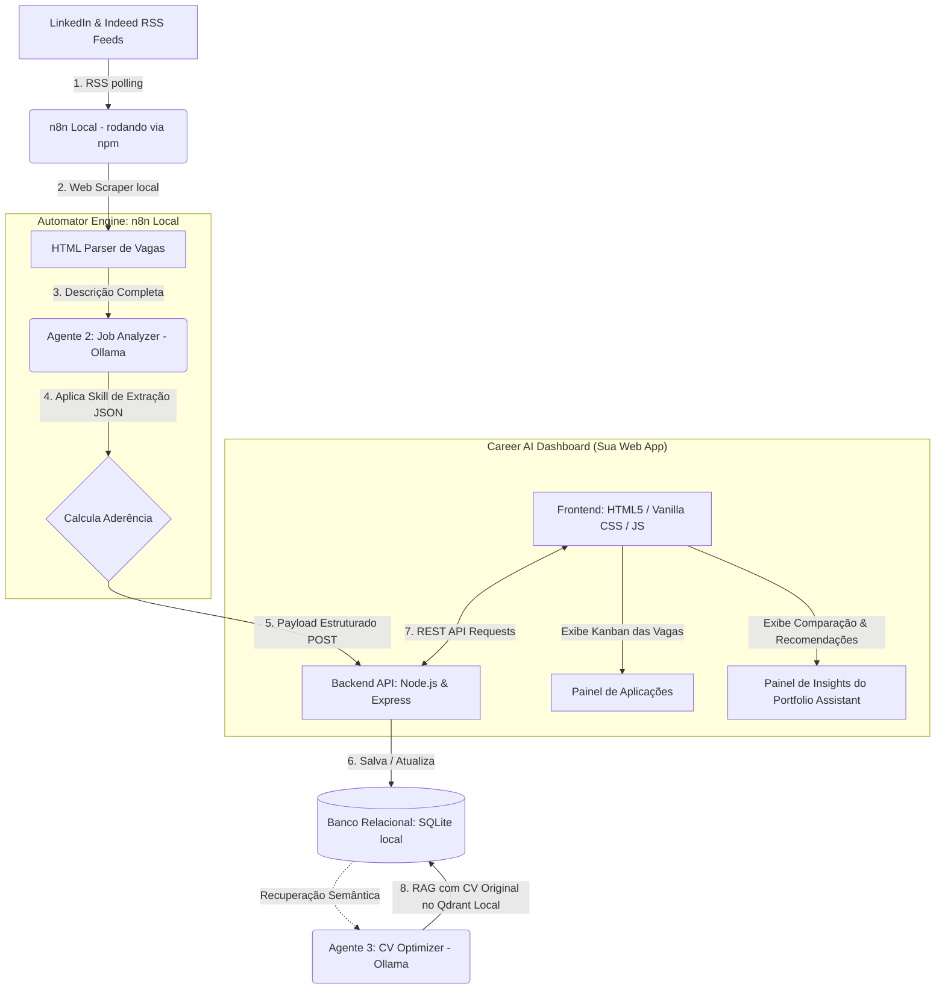
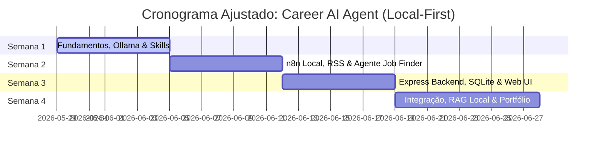

# Plano de Mentoria 30 Dias: Career AI Agent (Arquitetura Local-First & Custom Web App)

Bem-vindo ao blueprint atualizado do seu **Career AI Agent**. Com base na nossa sessão de alinhamento estratégico (`/grill-me`), desenhamos um sistema extraordinário, **100% Local-First**, com foco em soberania de dados, privacidade, custo zero de APIs e alto valor de engenharia de software para o seu portfólio.

Como **Product Designer**, você liderará a criação de um **Web Dashboard proprietário e exclusivo**, projetado sob medida com experiências visuais incríveis (glassmorphism, transições fluidas e dashboard Kanban), conectando-se a um banco de dados relacional **SQLite** local alimentado por fluxos automatizados do **n8n** e modelos cognitivos locais do **Ollama**.

---

## Mapeamento de Sinergia: Product Design ➔ AI & Custom Web App

Para acelerar seu aprendizado, conectaremos cada etapa técnica do desenvolvimento local e da web a conceitos de design que você já domina:

| Competência em Product Design | Equivalente no Design de Agentes & Web App | Aplicação no Projeto Career AI Agent |
| :--- | :--- | :--- |
| **User Research & Discovery** | *Data Ingestion* (RSS Feeds & Scraping) | Capturar vagas de feeds do LinkedIn/Indeed e raspar páginas HTML locais de forma ética. |
| **Information Architecture (IA)** | *Database Schema* (SQLite) & *RAG* | Modelar as tabelas do banco SQLite para controlar o status das vagas e buscar competências no currículo. |
| **UX & Interaction Flows** | *REST API* (Express) & *Workflows* (n8n) | Criar os canais de comunicação que levam os dados da vaga da automação até a tela do seu dashboard. |
| **UI Design System** | *CSS Custom Variables* & *Skills* de IA | Desenhar componentes web responsivos e estruturar as *Skills* lógicas do Ollama. |
| **Usabilidade & Feedback de IA** | *Human-in-the-Loop* Dashboard UI | Criar controles visuais no seu dashboard para revisar, ajustar e aprovar o currículo otimizado antes de salvar. |
| **Service Design & Blueprints** | Arquitetura Multiagentes & Orquestração | Orquestrar o fluxo que vai da busca da vaga à sugestão de portfólio diretamente na sua própria tela. |

---

## Arquitetura Técnica Detalhada (100% Local)

O ecossistema funcionará inteiramente em sua máquina local, garantindo privacidade absoluta do seu currículo e custo zero de execução:

---

## Cronograma de 30 Dias Refinado

### Semana 1: Fundamentos de IA, LLMs Locais (Ollama), Prompt Engineering e Skills
> [!NOTE]
> **Foco:** Configurar seu ambiente de inteligência artificial 100% local com Ollama, e programar as primeiras habilidades (*Skills*) lógicas.

*   **Dia 1: O Material de Design "Inteligência Local"**
    *   **Objetivo:** Instalar e configurar o Ollama no Windows; rodar modelos locais como Llama 3 ou Mistral e entender parâmetros de inferência.
    *   **Conceitos:** Inferência local, consumo de VRAM/RAM, quantização de modelos, latência de geração.
    *   **Exercício:** Instalar o Ollama, fazer o pull do modelo `llama3:8b` (ou `mistral`) e realizar testes de perguntas sobre design de produto via prompt direto.
    *   **Entregável:** Ambiente Ollama rodando localmente no Windows e pasta do projeto `/scratch/career-ai-agent` inicializada.
    *   **Tempo estimado:** 3h
    *   **Critério de Sucesso:** Rodar um prompt no terminal do Ollama e obter respostas rápidas (latência menor que 2 segundos por token).

*   **Dia 2: Engenharia de Prompts Estruturados em Modelos Locais**
    *   **Objetivo:** Adaptar técnicas de Prompt Engineering para modelos locais quantizados (que exigem instruções mais cirúrgicas que modelos gigantes de nuvem).
    *   **Conceitos:** Prompting sistemático, marcações XML (`<job_desc>`), delimitação de contexto para evitar desvios lógicos.
    *   **Exercício:** Criar o prompt de extração de requisitos que garanta que o Llama 3 local gere sempre um JSON limpo, sem texto explicativo extra.
    *   **Entregável:** Prompt estruturado testado e ajustado para o Llama 3 local em arquivo Markdown.
    *   **Tempo estimado:** 3h
    *   **Critério de Sucesso:** O modelo local processar um texto de vaga e gerar a saída JSON perfeitamente formatada 5 vezes seguidas.

*   **Dia 3: Anatomia de um Agente Local e Definição de Skills**
    *   **Objetivo:** Mapear o blueprint do sistema de agentes integrado com a nossa interface web.
    *   **Conceitos:** Fluxos de feedback do usuário para IAs locais (*Human-in-the-loop*), arquitetura orientada a APIs locais.
    *   **Exercício:** Modelar o fluxo de experiência do usuário (UX Map) do dashboard web, definindo como os agentes interagem com a interface.
    *   **Entregável:** Diagrama UX de fluxo de dados mostrando como o n8n, Ollama, SQLite e a Interface Web se comunicam.
    *   **Tempo estimado:** 4h
    *   **Critério de Sucesso:** Um mapa de fluxos legível que conecte as ações da IA com as interações de tela do dashboard.

*   **Dia 4: Criando a Skill 1 - Extração Semântica Local**
    *   **Objetivo:** Desenvolver uma skill encapsulada para rodar no Ollama local que extrai cargo, nível, empresa, requisitos técnicos e comportamentais.
    *   **Conceitos:** Structured Outputs em modelos locais, validação e tratamento de JSON quebrado (JSON parsing errors).
    *   **Exercício:** Escrever um script Node.js básico de validação que executa a chamada do Ollama local e valida a integridade do JSON retornado.
    *   **Entregável:** Módulo de código `skill_extraction.js` contendo a especificação lógica e a chamada da API local do Ollama.
    *   **Tempo estimado:** 3.5h
    *   **Critério de Sucesso:** O script rodar localmente e extrair os metadados de uma vaga de teste com perfeição.

*   **Dia 5: Desenvolvendo a Skill 2 - Calculadora de Matching Local**
    *   **Objetivo:** Criar a skill que analisa a intersecção de competências de UX (pesquisa, fluxos, UI) e gera notas de aderência.
    *   **Conceitos:** Lógica de pontuação semântica ponderada para áreas de especialidade em design de produto.
    *   **Exercício:** Desenvolver e calibrar o prompt da Skill de Matching para comparar dados do currículo do usuário com os requisitos da vaga.
    *   **Entregável:** Prompt e validador da Skill de Matching (`skill_matching.js`).
    *   **Tempo estimado:** 4h
    *   **Critério de Sucesso:** Receber duas estruturas JSON (Vaga e Candidato) e retornar uma pontuação de 0 a 100 com justificativas detalhadas estruturadas em categorias de UX.

*   **Dia 6: Design System de Skills e Documentação**
    *   **Objetivo:** Agrupar e estruturar as skills em uma biblioteca reutilizável local.
    *   **Conceitos:** Modularidade, reutilização de código em IA, documentação limpa para desenvolvedores e recrutadores.
    *   **Exercício:** Criar uma pasta `/skills` no projeto e documentar cada uma de forma elegante com inputs/outputs e casos de teste.
    *   **Entregável:** Biblioteca de Skills documentada no repositório.
    *   **Tempo estimado:** 3h
    *   **Critério de Sucesso:** Ter a documentação de referência das Skills com visual premium no Github/Markdown do projeto.

*   **Dia 7: Retrospectiva da Semana 1 & Storytelling de Portfólio**
    *   **Objetivo:** Consolidar os conceitos de IA local e rascunhar o início do case focado no Discovery Técnico e Decisões de Design de IA.
    *   **Conceitos:** Storytelling estratégico de engenharia de IA para gestores de produto.
    *   **Exercício:** Redigir a seção "Por que adotar uma abordagem Local-First?" do seu case study.
    *   **Entregável:** Primeiro capítulo do Case Study (`case_study.md`).
    *   **Tempo estimado:** 3h
    *   **Critério de Sucesso:** Redigir uma justificativa sólida de privacidade, controle e arquitetura local sob a ótica de Product Design.

---

### Semana 2: n8n Local, Conexões de Dados, RSS e o Agente Job Finder
> [!NOTE]
> **Foco:** Instalar e rodar o n8n localmente via npm, conectar feeds RSS de emprego (LinkedIn/Indeed) e montar o Agente 1 (Job Finder) para capturar vagas.

*   **Dia 8: Instalando e Configurando o n8n Local**
    *   **Objetivo:** Instalar o n8n local via npm no Windows, configurar credenciais básicas e dominar a interface visual.
    *   **Conceitos:** Node.js runtime, comandos npm globais, persistência local de dados do n8n (SQLite interno do n8n).
    *   **Exercício:** Rodar o n8n localmente, criar uma conta de desenvolvedor local e construir seu primeiro workflow "Hello World".
    *   **Entregável:** Instalação funcional do n8n rodando localmente em `http://localhost:5678`.
    *   **Tempo estimado:** 3h
    *   **Critério de Sucesso:** Acessar o painel do n8n local no navegador e salvar seu primeiro workflow de teste.

*   **Dia 9: Integração de Feeds RSS e Captura Padronizada**
    *   **Objetivo:** Configurar nós do n8n para ler feeds RSS públicos de vagas de emprego de forma programada e deduplicada.
    *   **Conceitos:** Parsing de XML de feeds RSS, filtragem de strings (Regex e JavaScript leve no n8n) para separar vagas de Product Design.
    *   **Exercício:** Criar um nó RSS Read configurado para buscar vagas do LinkedIn/Indeed e filtrar por palavras-chave como "Product Designer", "UX Designer", "UI Designer".
    *   **Entregável:** Fluxo n8n de triagem de feed RSS funcional.
    *   **Tempo estimado:** 4h
    *   **Critério de Sucesso:** Capturar novas vagas publicadas em feeds e transformá-las em itens de lista padronizados no n8n.

*   **Dia 10: Construção do Web Scraper Local de Detalhes da Vaga**
    *   **Objetivo:** Desenvolver a lógica no n8n para ler o link original da vaga capturada pelo feed RSS e raspar a descrição detalhada de forma ética.
    *   **Conceitos:** HTTP Request, parsing de HTML com seletores CSS no n8n (Node de HTML/Code), políticas de rate-limiting (respeito aos servidores).
    *   **Exercício:** Construir um fluxo que aceita a URL da vaga, acessa a página e extrai o bloco de texto principal correspondente à descrição do cargo.
    *   **Entregável:** Módulo "Scraper" acoplado ao fluxo do Job Finder no n8n.
    *   **Tempo estimado:** 4.5h
    *   **Critério de Sucesso:** Extrair a descrição de texto limpa de uma vaga sem tags HTML ou scripts desnecessários.

*   **Dia 11: Orquestração e Deduplicação no Agente 1 (Job Finder)**
    *   **Objetivo:** Consolidar o Agente 1 garantindo que ele busque vagas de forma agendada e não duplique registros.
    *   **Conceitos:** Logs locais de controle de histórico de vagas processadas, agendamentos cron no n8n.
    *   **Exercício:** Implementar um nó de comparação lógica no n8n que verifica se o ID da vaga já foi capturado anteriormente antes de dar prosseguimento.
    *   **Entregável:** Workflow completo `JobFinder_v1.json`.
    *   **Tempo estimado:** 4h
    *   **Critério de Sucesso:** O fluxo rodar sob demanda e separar com sucesso apenas vagas inéditas de Product Design.

*   **Dia 12: Conexão n8n ➔ Ollama Local**
    *   **Objetivo:** Integrar as chamadas do Ollama local diretamente dentro do fluxo visual do n8n.
    *   **Conceitos:** Conectores de IA do n8n, nós HTTP Request para APIs locais (`http://localhost:11434/api/generate`), manipulação de contextos em blocos visuais.
    *   **Exercício:** Configurar um nó HTTP Request no n8n que envia a descrição da vaga raspada para o Ollama local rodando a Skill de Extração (Dia 4) e retorna o JSON estruturado.
    *   **Entregável:** Subfluxo n8n de enriquecimento de dados de vagas com IA local.
    *   **Tempo estimado:** 3.5h
    *   **Critério de Sucesso:** Enviar uma vaga crua no n8n e receber de volta o JSON estruturado gerado pelo Ollama local na área de saída do nó.

*   **Dia 13: Experiência de Notificação Local (Desktop / Discord / Slack)**
    *   **Objetivo:** Criar um fluxo de notificação rápido para alertar o usuário quando vagas com matching muito alto forem identificadas.
    *   **Conceitos:** Alertas locais de sistema operacional (Windows Toast notifications via script local ou webhooks rápidos para Discord local).
    *   **Exercício:** Configurar o n8n para enviar uma mensagem rica e formatada para um canal privado do Discord (ou Slack) com a descrição da vaga otimizada e o score de aderência.
    *   **Entregável:** Sistema de alertas conectado ao workflow de vagas.
    *   **Tempo estimado:** 3h
    *   **Critério de Sucesso:** Receber uma notificação visual bonita no Discord/Slack sempre que uma vaga qualificada for processada pelo sistema.

*   **Dia 14: Retrospectiva da Semana 2 & Engenharia de Integração**
    *   **Objetivo:** Revisar os fluxos criados, documentar o fluxo de ETL (Extração, Transformação e Carga) no case de portfólio.
    *   **Conceitos:** Arquitetura de microsserviços locais, documentação técnica com visual premium.
    *   **Exercício:** Adicionar a arquitetura do Job Finder e do n8n local ao arquivo do case study, com capturas de tela dos workflows.
    *   **Entregável:** Segundo capítulo do Case Study atualizado.
    *   **Tempo estimado:** 3h
    *   **Critério de Sucesso:** Ter a documentação de automação impecável e pronta para apresentar.

---

### Semana 3: Express Backend, SQLite e Criação do Web Dashboard (UX/UI Premium)
> [!NOTE]
> **Foco:** Criar o banco SQLite, programar um servidor Express.js e construir o frontend do seu dashboard com design system CSS contemporâneo, suporte a Kanban e visualização de vagas.

*   **Dia 15: Modelagem de Dados com SQLite local**
    *   **Objetivo:** Criar a estrutura de tabelas relacionais do banco SQLite local para guardar as vagas, perfis, status de candidatura e notas de matching.
    *   **Conceitos:** Bancos de dados relacionais (SQL), tabelas, chaves primárias/estrangeiras, tipos de dados, consultas SQL básicas.
    *   **Exercício:** Instalar a extensão SQLite no VSCode e criar o script de inicialização do banco `db_init.sql`.
    *   **Entregável:** Banco de dados `career_ai.db` inicializado localmente com as tabelas de vagas, candidaturas e competências.
    *   **Tempo estimado:** 3.5h
    *   **Critério de Sucesso:** Executar comandos SQL locais para criar tabelas e inserir uma vaga de teste com sucesso.

*   **Dia 16: Desenvolvendo a API com Node.js e Express**
    *   **Objetivo:** Criar o servidor backend local que fará a ponte entre o n8n, o banco de dados e a nossa interface Web.
    *   **Conceitos:** Servidor HTTP Express, criação de rotas REST API (GET `/jobs`, POST `/jobs`, PUT `/jobs/:id`), conexão com SQLite através de biblioteca Node (`sqlite3` ou `better-sqlite3`).
    *   **Exercício:** Escrever o código do backend (`server.js`) expondo endpoints seguros para salvar novas vagas e alterar status.
    *   **Entregável:** Servidor API Express rodando localmente na porta 3000.
    *   **Tempo estimado:** 4.5h
    *   **Critério de Sucesso:** Enviar um POST via n8n para a API local e ver o dado persistido com sucesso no banco SQLite.

*   **Dia 17: Conectando o n8n à sua API e Banco SQLite**
    *   **Objetivo:** Fazer com que o fluxo final da Semana 2 envie os dados processados pelas Skills de IA diretamente para o banco SQLite através da API Express.
    *   **Conceitos:** Integração de ponta a ponta n8n-Express, tratamento de concorrência em requisições de banco de dados.
    *   **Exercício:** Modificar a etapa final do n8n para enviar requisições POST com o payload estruturado da vaga para a API Express.
    *   **Entregável:** Automação do n8n agora inserindo vagas em tempo real no seu banco de dados local.
    *   **Tempo estimado:** 4h
    *   **Critério de Sucesso:** Ver novas vagas raspadas e analisadas pelo Ollama aparecendo automaticamente na tabela SQLite.

*   **Dia 18: Construção do Frontend - Estrutura e Design System CSS (Dia UI Sênior)**
    *   **Objetivo:** Iniciar a criação da interface do seu dashboard aplicando conceitos de UI modernos (estilo dark mode minimalista, HSL cores selecionadas, tipografia Google Fonts, CSS Grid e Flexbox).
    *   **Conceitos:** CSS Custom Properties (variáveis para o Design System), tipografia Outfit/Inter, reset CSS contemporâneo, layout responsivo.
    *   **Exercício:** Estruturar a página principal `index.html` e criar o arquivo `style.css` definindo os tokens de design system do seu portfólio.
    *   **Entregável:** Template estático do Dashboard funcional e esteticamente deslumbrante.
    *   **Tempo estimado:** 4.5h
    *   **Critério de Sucesso:** Interface visual estática limpa, responsiva e com identidade visual premium alinhada com as melhores práticas de UX/UI.

*   **Dia 19: Construindo o Painel Kanban Interativo (Drag and Drop com JS)**
    *   **Objetivo:** Implementar o painel Kanban onde o usuário pode gerenciar suas vagas arrastando colunas (Triagem, Favoritas, Aplicadas, Entrevista, Oferecida).
    *   **Conceitos:** Manipulação do DOM com Vanilla JS, eventos drag-and-drop nativos do HTML5, sincronização de estado com a API backend (PUT requests).
    *   **Exercício:** Escrever o JavaScript que permite arrastar os cards de vaga entre as colunas do Kanban e salvar o novo status no banco SQLite instantaneamente.
    *   **Entregável:** Kanban interativo rodando e sincronizando com o backend.
    *   **Tempo estimado:** 5h
    *   **Critério de Sucesso:** Mudar um card de coluna na tela e verificar no banco SQLite que o status da vaga correspondente foi atualizado.

*   **Dia 20: Detalhes do Job, Storytelling de Matching e Componentes de UI**
    *   **Objetivo:** Criar um modal rico de exibição dos detalhes da vaga, contendo as análises estruturadas geradas pelo Ollama (skills exigidas, nota de matching detalhada, pontos fortes e fracos).
    *   **Conceitos:** Modais de UI acessíveis, visualização de dados textuais de forma agradável, gráficos de progresso circulares/barras CSS.
    *   **Exercício:** Projetar e programar a abertura do modal ao clicar em um card do Kanban, preenchendo as informações dinamicamente via JS.
    *   **Entregável:** Modal de detalhes de vaga totalmente funcional e responsivo.
    *   **Tempo estimado:** 4h
    *   **Critério de Sucesso:** Clicar em uma vaga e ver um painel de insights visualmente incrível apresentando a triagem de IA local.

*   **Dia 21: Retrospectiva da Semana 3 & UX de Aplicação Web**
    *   **Objetivo:** Refinar a interface com micro-animações, estados de hover suaves, feedback visual de carregamento (skeletons e spinners) e polimento geral.
    *   **Conceitos:** Micro-interactions em UX/UI, transições CSS fluidas, design de estados de erro e vazios (*empty states*).
    *   **Exercício:** Adicionar transições e estados interativos aos cards e botões do dashboard; documentar o processo de design da interface no case.
    *   **Entregável:** Terceiro capítulo do Case Study concluído com a evolução da interface e da engenharia do dashboard.
    *   **Tempo estimado:** 3h
    *   **Critério de Sucesso:** A interface parecer fluida, viva e extremamente polida de acordo com padrões de design sênior.

---

### Semana 4: RAG Local, Agentes de Otimização e Storytelling de Casos, Monitoramento e Portfólio
> [!NOTE]
> **Foco:** Configurar o RAG local com Qdrant/Pinecone ou SQLite FTS, programar os Agentes de CV Optimization e Portfolio Assistant, monitorar custos de tempo, e consolidar o case de portfólio.

*   **Dia 22: O que é RAG (Retrieval-Augmented Generation) Local na Prática**
    *   **Objetivo:** Compreender embeddings e implementar uma busca semântica simples local para recuperar as seções mais relevantes do seu currículo.
    *   **Conceitos:** Embeddings vetoriais locais (via biblioteca leve de JS ou API local de Embeddings do Ollama), busca semântica em banco vetorial local (Qdrant em Docker ou biblioteca leve em node).
    *   **Exercício:** Criar um script Node que converte o texto do seu currículo original (arquivos PDF/HTML da pasta scratch) em embeddings locais do Ollama e faz uma consulta de busca por similaridade de cosseno.
    *   **Entregável:** Motor de busca semântica local funcional `rag_search.js`.
    *   **Tempo estimado:** 4h
    *   **Critério de Sucesso:** Fazer uma pergunta semântica localmente (ex: "Trabalhos de Discovery") e obter os parágrafos corretos de realizações profissionais do seu currículo.

*   **Dia 23: Construindo o Agente 3 - CV Optimizer Local com RAG**
    *   **Objetivo:** Implementar a lógica onde o Ollama lê a descrição detalhada da vaga e reconstrói seções do seu currículo com base nas realizações encontradas pelo RAG local, criando uma versão otimizada ética.
    *   **Conceitos:** Prompts de edição focados, técnicas de síntese semântica e alinhamento de tom profissional técnico de design.
    *   **Exercício:** Programar a Skill de Otimização que gera textos otimizados para currículo a partir do casamento de dados do RAG + dados da Vaga.
    *   **Entregável:** Motor de otimização de CV integrado ao backend Express.
    *   **Tempo estimado:** 4.5h
    *   **Critério de Sucesso:** O dashboard mostrar uma seção "Currículo Personalizado Sugerido" contendo os bullets de experiência reescritos especificamente focando na vaga de interesse.

*   **Dia 24: Desenvolvendo o Agente 5 - Portfolio Assistant & Preparador de Entrevistas**
    *   **Objetivo:** Criar o agente focado em analisar os requisitos da vaga e apontar quais cases de design do seu portfólio você deve destacar e qual história contar em entrevistas.
    *   **Conceitos:** Storytelling STAR (Situação, Tarefa, Ação, Resultado) para designers de produto, alinhamento estratégico de narrativa de portfólio.
    *   **Exercício:** Escrever o prompt do Portfolio Assistant local que extrai os desafios da empresa contratante e gera um guia de entrevista com 3 perguntas prováveis e respostas recomendadas baseadas nos seus cases reais.
    *   **Entregável:** Painel "Portfolio Assistant" no dashboard mostrando o guia de preparação de entrevista para cada vaga.
    *   **Tempo estimado:** 4h
    *   **Critério de Sucesso:** Clicar na aba "Preparar para Entrevista" no card do modal e ver um script estruturado personalizado de altíssima qualidade cognitiva.

*   **Dia 25: Human-in-the-Loop: Revisão, Edição e Exportação de PDF**
    *   **Objetivo:** Desenvolver uma área interativa no dashboard onde você pode editar as sugestões da IA e clicar em um botão para exportar seu currículo otimizado formatado em HTML/PDF elegante.
    *   **Conceitos:** UX de ferramentas de edição de IA (co-criação humano-máquina), bibliotecas de geração de PDF no frontend/backend (ex: `html2pdf.js` ou PDF print styles).
    *   **Exercício:** Criar o editor rich-text leve no modal e programar a exportação do currículo customizado no padrão estético senior.
    *   **Entregável:** Função de exportação de currículos customizados funcionando no Dashboard.
    *   **Tempo estimado:** 4.5h
    *   **Critério de Sucesso:** Conseguir editar as sugestões do Ollama no dashboard e exportar um currículo em formato A4 PDF impecável e pronto para envio em menos de 1 minuto.

*   **Dia 26: Telemetria, Custos Locais e Monitoramento de Erros**
    *   **Objetivo:** Monitorar o consumo do ecossistema local (latências, tempos de resposta de IA, taxas de erro do scraper) para comprovar a eficiência técnica do sistema.
    *   **Conceitos:** Métricas de performance de IA (tempo até o primeiro token - TTFT, tokens por segundo), monitoramento de logs de rotas Express.
    *   **Exercício:** Criar um painel de "Status do Ecossistema" no seu dashboard mostrando métricas reais de tempo de processamento e volume de dados processados.
    *   **Entregável:** Sistema de logs e telemetria integrado na tela do painel.
    *   **Tempo estimado:** 3.5h
    *   **Critério de Sucesso:** Ver no dashboard as estatísticas reais de performance local provando que o sistema é otimizado e profissional.

*   **Dia 27: Consolidação do Case Study de Portfólio - O Problema & Arquitetura**
    *   **Objetivo:** Escrever a seção principal do seu case de portfólio focada no contexto de negócio, discovery, arquitetura técnica e interface de design proprietária.
    *   **Conceitos:** Casos de portfólio premium que impressionam diretores de produto, linguagem focada em resultados, decisões de produto justificadas.
    *   **Exercício:** Organizar e escrever a primeira metade do case study final estruturado em Markdown, contendo os diagramas de fluxo de dados locais refinados.
    *   **Entregável:** Arquivo `case_study_final.md` (Parte 1).
    *   **Tempo estimado:** 4h
    *   **Critério de Sucesso:** Apresentar a arquitetura multiagentes e as decisões de design da interface web de forma clara, técnica e extremamente envolvente.

*   **Dia 28: Consolidação do Case Study - Resultados, Lições e Storytelling Visual**
    *   **Objetivo:** Concluir a redação do case com os resultados gerados, lições de engenharia de software aprendidas pelo designer e capturas de tela deslumbrantes do dashboard local funcionando.
    *   **Conceitos:** Storytelling visual de projetos complexos, métricas de impacto de produto (redução do tempo de aplicação em 90%, aumento de fit semântico).
    *   **Exercício:** Capturar os prints do seu dashboard premium, estruturar o carrossel de fotos no Markdown e fechar a conclusão do projeto.
    *   **Entregável:** Arquivo `case_study_final.md` concluído e publicado no repositório.
    *   **Tempo estimado:** 4.5h
    *   **Critério de Sucesso:** O case de portfólio final possuir um design de narrativa tão impressionante que serve como diferencial competitivo absoluto em qualquer vaga global de Product Design / IA.

*   **Dia 29: Atualização de Perfil de LinkedIn, Currículo e Pitch para Entrevistas**
    *   **Objetivo:** Ajustar suas redes sociais e currículo para destacar suas novas habilidades inovadoras em Engenharia de Agentes, automações no n8n e IA local integrada ao design.
    *   **Conceitos:** Posicionamento de mercado como Designer de Produto Inteligente (AI Product Designer), pitch profissional de elevador (elevator pitch).
    *   **Exercício:** Escrever sua nova bio de LinkedIn, criar bullets impactantes detalhando a criação do "Career AI Agent" e simular o roteiro de apresentação do projeto em entrevistas.
    *   **Entregável:** Guia de Preparação de Carreira e Atualização de LinkedIn prontas.
    *   **Tempo estimado:** 4h
    *   **Critério de Sucesso:** Seu novo perfil comunicar com clareza a capacidade sênior de conceber, desenhar e implementar sistemas funcionais baseados em inteligência artificial.

*   **Dia 30: Grande Demonstração do Produto & Roadmap Futuro**
    *   **Objetivo:** Rodar o sistema de ponta a ponta em produção real na sua máquina, iniciar a prospecção de empregos global e projetar a evolução (v2) do ecossistema.
    *   **Conceitos:** Roadmap e planejamento de ciclo de vida de produto digital, iteração ágil baseada em feedbacks práticos.
    *   **Exercício:** Realizar um teste real carregando 5 novas vagas de emprego recolhidas na manhã, deixar os agentes executarem toda a esteira e planejar o roadmap da próxima versão.
    *   **Entregável:** Roadmap da v2 e conclusão do programa de mentoria com o ecossistema 100% ativo e rodando.
    *   **Tempo estimado:** 3h
    *   **Critério de Sucesso:** O ecossistema completo rodando com zero falhas locais e apresentando um Kanban rico de vagas com análises profundas e currículos customizados prontos para uso real.

---

## Estrutura do Case de Portfólio Final (`case_study_final.md`)

O documento final que criaremos juntos na última semana terá a seguinte estrutura rica:

1.  **Resumo Executivo (TL;DR):** O impacto rápido de conciliar Product Design de Alta Performance com Engenharia de Automações e IA local para acelerar contratações globais.
2.  **Contexto e Desafio:** O mercado competitivo de tecnologia e o esgotamento do designer de produtos ao triar vagas manualmente de forma pouco cirúrgica.
3.  **Discovery e Modelagem de IA Local:** Como o entendimento de sistemas ATS guiou o setup local de embeddings e o RAG para evitar alucinações cognitivas.
4.  **Decisões de Design de IA e Skills:** Por que estruturar Skills modulares ao invés de prompts genéricos no Llama 3 local. Trade-offs de performance computacional.
5.  **Arquitetura do Ecossistema Local:** Diagramas de fluxo de dados locais, mapeamento multiagente (n8n, API Express, banco SQLite).
6.  **A Solução em Ação (Interface e UX/UI):** Screenshots sugeridos do Dashboard proprietário, mostrando o Kanban interativo, modal de triagem e o editor do CV Optimizer.
7.  **Resultados Obtidos (Métricas de Sucesso):** Tempo de processamento local, acurácia semântica do matching e facilidade de revisão humano-no-loop.
8.  **Lições Aprendidas & Próximos Passos:** O que a jornada de programar como Designer ensinou sobre o futuro do design de produtos digitais no ecossistema de agentes autônomos.

---

## Próximos Passos para Começarmos

1. **Aprovação do Plano Ajustado:** Se você adorou a arquitetura Local-First e o Custom Web App, me dê o seu sinal verde de aprovação.
2. **Definição do Workspace:** Começaremos criando a subpasta dedicada `/scratch/career-ai-agent` que centralizará todos os nossos códigos do servidor, frontend, banco e automações do n8n.
3. **Início do Dia 1:** Assim que aprovado, começaremos imediatamente a primeira aula do **Dia 1: Instalação, Setup do Ollama e Inferência Local**! Estou pronto e animadíssimo!
